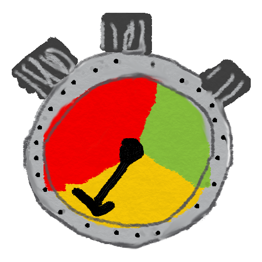

<table style="width: 100%; border: none">
<tr>
<td valign="top" style="width: 10%; border: none">

</td>
<td valign="top" style="border: none">

<strong>Min Time</strong> is a countdown app. It's main goal is to help you structure your talks and presentations. It divides the talk time into three phases: green, yellow and red. With a glimpse you get an idea how much time is left.

For example, a 70 minutes talk could be divided into 50, 15 and 5 minute segments. Once started, <strong>Min Time</strong> counts down from 70 to 0, changing colors and vibrating when a new phase is reached. During presentation you can switch to other apps. The app is intentionally kept simple. Just a few taps and you are ready to give your talk. To finish your presentations and tasks just in time.

But most important:

<ul>
<li>No in-app purchases</li>
<li>No ads</li>
<li>No need to unlock anything</li>
<li>We respect your privacy</li>
<li>Completely <a href="https://github.com/tkuenneth/mintime">open source</a></li>
</ul>

 Google Play and the Google Play logo are trademarks of Google LLC.

</td>
</tr>
</table>

Made with &#160;❤&#160; by <a href="https://www.thomaskuenneth.eu/">Thomas K&uuml;nneth</a>

